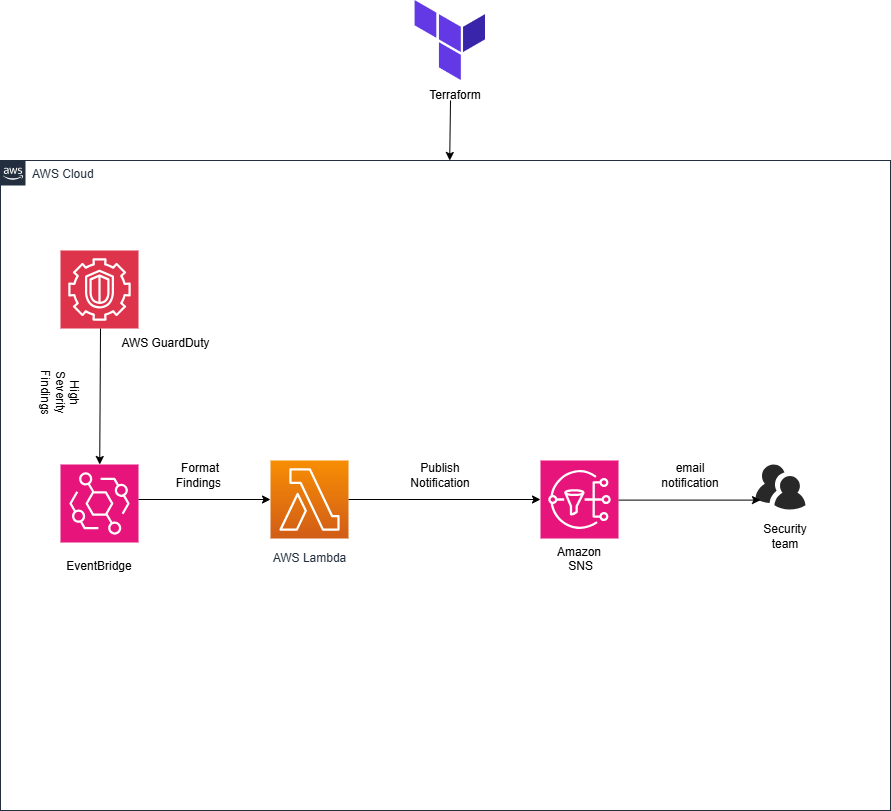
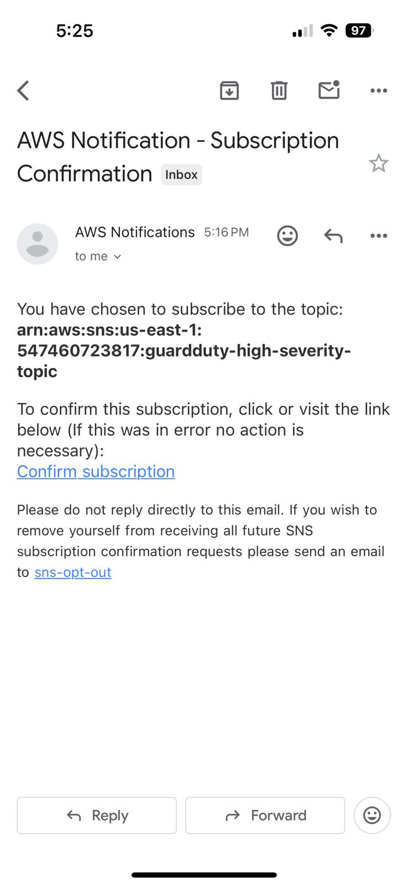
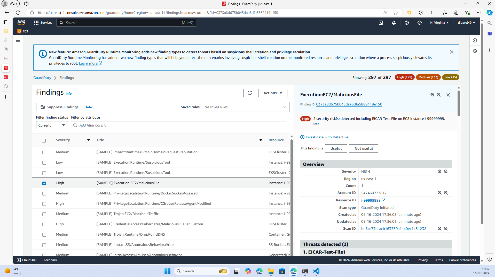
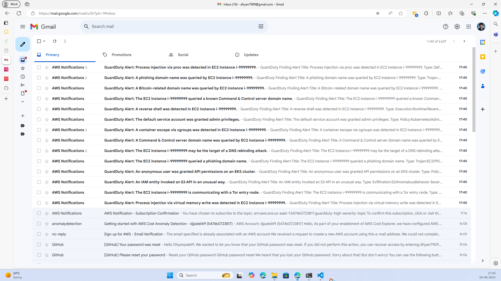

# Cloud Security Automation AWS Threat Detection and Notification
## Table of Contents
- [Overview](#overview)
- [Architecture](#architecture)
- [Components](#Components)
- [Deployment Steps](#deployment-steps)
- [Testing the Setup](#testing-the-setup)
- [Cleanup](#cleanup)
- [Cost Considerations](#cost-considerations)
- [Conclusion](#conclusion)
- [References](#references)
- [License](#license)
- [Contact](#contact)

## Overview
This project implements an **AWS-based Threat Detection** **and Alerting System** designed to automatically detect and notify security teams of high-severity threats in a cloud environment. Leveraging **AWS GuardDuty** for real-time threat detection, **EventBridge** for event-driven triggers, **AWS Lambda** for processing findings, and **AmazonSNS** for sending email notifications, this solution enhances cloud security by providing automated monitoring and alerts.

The infrastructure is provisioned and managed using **Terraform**, enabling easy and scalable deployment.

Key Features:
- **Real-Time Threat Detection**: AWS GuardDuty continuously monitors the environment for malicious activities and security threats.
- **Event-Driven Processing**: Amazon EventBridge captures high-severity findings from GuardDuty and triggers AWS Lambda functions for further processing.
- **Automated Alerts**: AWS Lambda formats the findings into human-readable notifications and publishes them to Amazon SNS, which sends alerts via email to the security team.
- **Monitoring and Logging**: AWS CloudWatch tracks the performance and logs of the Lambda function for audit and troubleshooting.
This project demonstrates how automation can improve cloud security by streamlining the process of detecting and responding to security incidents in real-time.
## Architecture
The architecture of the AWS-based Threat Detection and Alerting System is shown below:



## Components

| Component       | Description                                                                 |
|-----------------|-----------------------------------------------------------------------------|
| **AWS GuardDuty**   | Monitors your AWS environment for malicious activities and security threats. |
| **Amazon EventBridge** | Captures high-severity findings from GuardDuty and triggers further actions. |
| **AWS Lambda**   | Processes and formats threat data from EventBridge and sends notifications. |
| **Amazon SNS**   | Sends email notifications to the security team based on Lambda's output.   |
| **Amazon CloudWatch** | Logs and monitors the performance of the Lambda function.              |
| **Terraform**    | Provisions and manages all AWS resources in this solution.                |

## Deployment Steps
1. **Install Required Tools**
   Ensure that you have the following tools installed:
   - AWS CLI: For interacting with AWS services.
   - Terraform: For provisioning AWS infrastructure.
   - Git: To manage the project repository.
     
2. **Clone the repositor**
    ```bash
   git clone https://github.com/yourusername/aws-threat-detection.git
   cd aws-threat-detection

3. **Prepare the Lambda Function**
   - Create a file named lambda_function.py with the following content:
 ```python
import json
import os
import boto3

sns_client = boto3.client('sns')
sns_topic_arn = os.environ['SNS_TOPIC_ARN']

def lambda_handler(event, context):
    # Parse the GuardDuty finding
    detail = event.get('detail', {})
    finding_type = detail.get('type', 'Unknown')
    severity = detail.get('severity', 'Unknown')
    description = detail.get('description', 'No description provided')
    region = detail.get('region', 'Unknown')
    account = detail.get('accountId', 'Unknown')
    time = detail.get('updatedAt', 'Unknown')
    title = detail.get('title', 'GuardDuty Finding')

    # Format the message
    message = f"""
    GuardDuty Finding Alert

    Title: {title}
    Type: {finding_type}
    Severity: {severity}
    Account ID: {account}
    Region: {region}
    Time: {time}

    Description:
    {description}

    Recommendation:
    Please review the finding in the AWS GuardDuty console and take appropriate action.

    Link to Finding:
    https://{region}.console.aws.amazon.com/guardduty/home?region={region}#/findings?macros=current&fId={detail.get('id', '')}
    """

    # Publish the message to SNS
    response = sns_client.publish(
        TopicArn=sns_topic_arn,
        Subject=f"GuardDuty Alert: {title}",
        Message=message
    )

    return {
        'statusCode': 200,
        'body': json.dumps('Notification sent')
    }
```

4.**Configure Terraform Variables**
  - Update the "variables.tf" file to chnage the default value:
 ```python
  variable "aws_region" {
  description = "AWS region to deploy resources in"
  type        = string
  default     = "us-east-1"
 }

variable "email_address" {
  description = "Email address to receive SNS notifications"
  type        = string
  default     = "dhyan7909@gmail.com" 
}
```
5.**Initialize Terraform**
```Bash
terraform init
```
6.**Review the Execution Plan**
```Bash
terraform plan
```
7.**Apply the Configuration**
```Bash
terraform apply
```
- Type **Yes** when prompted to confirm.

8.**Confirm SNS Subscription**
  - Check your email inbox for a confirmation message from AWS SNS.
  - Click the "Confirm subscription" link in the email.

**Screenshot: SNS Subscription Confirmation Email**



## Testing the Setup
1.**Generate Sample GuardDuty Findings
 - Using AWS CLI:
   ```python
   aws guardduty create-sample-findings \
      --detector-id $(terraform output -raw guardduty_detector_id) \
      --finding-types "Recon:EC2/PortProbeUnprotectedPort" ```

 - Using AWS Console:
    - Navigate to GuardDuty > Settings
    - Click on "Generate Sample findings."

**Screenshot : Generating Sample Findings in AWS Console**



2.**Verifiy Email Notifications
  - Check the notification you get from the SNS topic
  - The email Should contain a formatted message with details about the GuardDuty findings.
**Sample Email Notification**


**Sample Email Content**
![SampleEmailContent](./Images/SampleEmail.png}

## Cleanup
Instructions for cleaning up the resources...

## Cost Considerations
Details on costs...

## Conclusion
Summarize your findings here...

## References
Any references or links...

## License
Details about the license...

## Contact
Information for reaching you...


